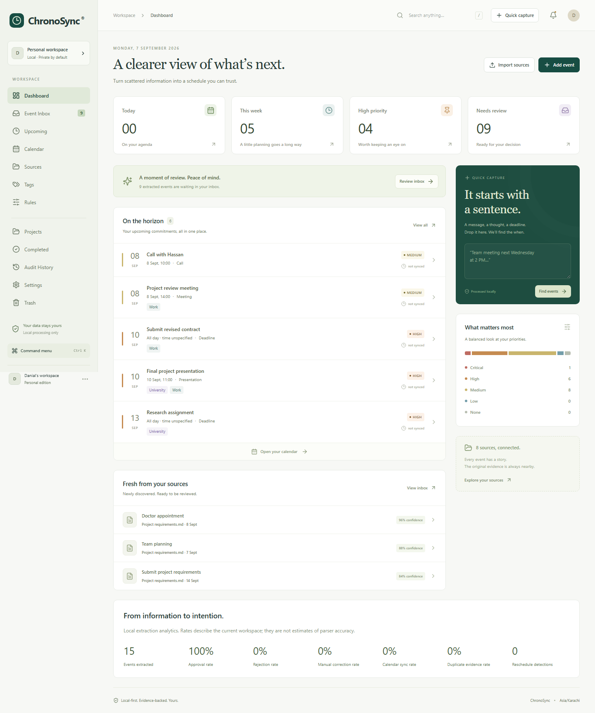

# ChronoSync

### From scattered information to a schedule you can trust.

A local-first document, transcript and message calendar assistant. Import a source, inspect candidate commitments and their exact evidence, then approve them for your workspace or calendar.

**Status:** working local application with automated backend, temporal and browser validation. Real Outlook writes remain unverified. See [validation and limitations](docs/VALIDATION.md).

**Android and private cloud edition:** invitation-only accounts (up to three), PostgreSQL persistence, a Render Free deployment template, and an Android APK client are now included. Cloud publishing requires your Render and Neon accounts. See [mobile installation, free hosting, and limitations](docs/MOBILE_HOSTING.md). Free hosting sleeps when idle; the APK does not provide native alarms or offline processing.



## The problem

Deadlines are scattered across PDFs, conversations and email. A date alone is insufficient: “tomorrow” needs a source timestamp, “moved to Thursday” needs an existing event, and “not Monday” must not produce a Monday appointment. ChronoSync keeps the context beside the decision.

## Features

- Dashboard, split Event Inbox, Upcoming, month/week/day/agenda Calendar, Sources, Tags, Rules, Projects, Completed, Audit History, Settings and recoverable Trash.
- Explicit paste and batch file import with isolated failures, checksums and source-version comparisons.
- Deterministic date arithmetic, source timestamps, IANA timezones, review warnings, recurrence, business times and date ranges.
- Exact evidence, PDF page numbers, DOCX paragraph references, transcript offsets and chat sender metadata where available.
- Manual creation, editing, completion, archiving, snoozing, pinning, attachments and related event references.
- Five importance levels, reminder profiles, custom tags, ordered rules, project timelines, search and saved filters.
- Duplicate review, exact duplicate evidence attachment, proposed reschedules/cancellations, conflicts and calendar reconciliation.
- Mock calendar, Outlook Desktop COM adapter and ICS export. No automatic invitations or unreviewed calendar writes.
- CSV, JSON, Excel and settings backup export; validated preference backup import through the API.
- Command palette (`Ctrl+K`) and typing-safe shortcuts (`N`, `I`, `T`, `/`).

## Installation — Windows

Requires Python 3.11+ and Node.js 20.19+. Development uses Python 3.13.

`requirements-lock-windows.txt` records the exact validated Windows Python environment, including optional MSG/Outlook and development dependencies. The frontend uses `package-lock.json` for reproducible installs.

```powershell
git clone https://github.com/danial-maqbool/ChronoSync.git
cd ChronoSync
py -3.13 -m venv .venv
.\.venv\Scripts\python.exe -m pip install -r requirements.txt
cd frontend
npm.cmd ci
npm.cmd run build
cd ..
python run.py
```

Open [the local app](http://127.0.0.1:8765). The launcher uses the repository virtual environment when present. Alembic migrations run automatically. Normal data lives in ignored `data/chronosync.db`. The server binds to loopback only.

Optional Windows/MSG dependencies:

```powershell
.\.venv\Scripts\python.exe -m pip install -r requirements-windows.txt
```

Classic Outlook and a configured local profile are required for COM. An installed package is not proof of a working calendar connection. On other platforms, use `python3 -m venv .venv`, `.venv/bin/python` and `npm`; mock and ICS are platform-independent.

## Demo

In Sources, choose **Load synthetic demo**. Eight fictional sources cover university, work, chat, payment, travel, renewal, interview and projects. Demo dates are anchored to demo creation time and extracted events begin in review.

Generate real synthetic input files:

```powershell
.\.venv\Scripts\python.exe scripts/generate_demo.py
```

Files are written under ignored `data/demo`, including PDF, DOCX, VTT, chat TXT and EML.

## Architecture

```text
File / pasted text → Format parser → Evidence segments + source timestamps
  → Deterministic date resolution + contextual rules
  → Importance + tags + confidence + duplicate/change proposals
  → SQLite workspace → Human review
  → CalendarProvider → Mock / Outlook; or ICS file export
  → In-app reminder scheduler + audit history
```

FastAPI and Pydantic v2 validate APIs. SQLAlchemy persists record categories in SQLite JSON, with Alembic migrations. React, TypeScript, Vite, Tailwind CSS and Lucide provide the frontend. Production assets are served by FastAPI; the Vite development proxy targets port 8765. See [architecture](docs/ARCHITECTURE.md).

## Input formats

| Format | Behavior |
|---|---|
| PDF | PyMuPDF text and page references; scanned-only PDFs report OCR needed |
| DOCX | Paragraphs and table rows; no invented page numbers |
| TXT / MD | Lines, text and timestamped WhatsApp-style messages |
| SRT / VTT | Cue text, start/end offsets and speaker when present |
| EML | Body, sender, recipients, subject and email timestamp |
| MSG | Optional extract-msg; real fixture validation pending |
| HTML | Visible text; scripts/styles excluded |
| JSON | Message arrays or messages wrapper; Slack-style ts/user/text |
| CSV | text/message/content, timestamp/date and sender columns |
| Paste | Explicit text capture with optional source date |

## Temporal reasoning and event extraction

Named/numeric/ISO dates, weekdays, tomorrow, relative days/weeks/months, configured EOD/COB, date/time ranges, recurrence and common business-day expressions are supported. “Next Friday” means Friday of the next Monday-starting week; the explanation shows the convention.

Message/email timestamps precede explicit document dates, user source dates and import time. A transcript offset is evidence, not a calendar date. Missing years use the reference year with an explanation, never a silent one-year rollover. Timezone abbreviations and DST gaps/folds require review.

Historical statements are filtered. Negation excludes rejected dates. “At 4” requires AM/PM review. Date-only events retain unknown time and use an all-day calendar representation unless the user configures a deadline time. See [temporal reasoning](docs/TEMPORAL_REASONING.md).

## Importance, tags and reminders

Importance is CRITICAL, HIGH, MEDIUM, LOW or NONE. Urgency, penalties, deadlines and event types inform suggestions; users can override them. Tags can be created, colored, renamed, archived or removed without deleting events. Ordered rules can assign tags, importance and reminder offsets.

Multiple reminders are stored in minutes before the event, with editable importance profiles. Snooze delays the notification without moving the event. The app scheduler runs while the process runs. ICS exports multiple VALARMs. Outlook uses one native reminder, selecting the smallest offset.

## Source provenance, duplicates and changes

Every candidate retains evidence and its reference date. Titles and notes do not mutate source evidence. Exact title/start/end duplicates attach references to one logical event. Possible duplicates offer merge or keep-both. Reschedules and cancellations are reviewable proposals; applied changes retain before/after history. Same-name source versions report changed and removed candidates without silently deleting events.

## Calendar synchronization and conflicts

Mock is the default persistent local test provider. Approve first, then sync. Overlap and buffer conflicts require a keep-both choice. Recurrence conflicts expand over 90 days. Editing offers app-only or app-and-calendar. External edits block silent overwrite. External deletions become CALENDAR_MISSING; accepting a missing link does not recreate the event. App-only deletion preserves the calendar copy.

ICS is a file handoff, not direct synchronization. See [calendar integration](docs/CALENDAR_INTEGRATION.md) for Outlook, reconciliation and manual testing.

## Privacy

Local processing, AI disabled, no clipboard monitoring, no automatic invitations and no external visual assets. Original binaries are parsed but not retained; extracted text and events stay in local SQLite. Databases, user inputs, exports, tokens and credentials are excluded from Git. Screenshots use synthetic data. See [privacy](docs/PRIVACY.md).

## Testing

```powershell
.\.venv\Scripts\python.exe -m pytest -q
.\.venv\Scripts\python.exe scripts/benchmark.py
cd frontend
npm.cmd test
npm.cmd run build
npx.cmd playwright install chromium
npm.cmd run e2e
```

The benchmark has **68 fixed ground-truth cases**. Playwright uses an isolated fresh database and mock calendar. Automated tests never write to Outlook. See [validation](docs/VALIDATION.md) and [benchmark output](docs/validation/temporal-benchmark.json).

Manual Outlook testing is separate:

```powershell
.\.venv\Scripts\python.exe scripts/test_outlook_calendar.py
```

The script requires explicit CREATE and DELETE input for a real test appointment.

## Screenshots

[Inbox](docs/screenshots/event_inbox.png) · [Upcoming](docs/screenshots/upcoming.png) · [Calendar](docs/screenshots/calendar.png) · [Details](docs/screenshots/event_detail.png) · [Evidence](docs/screenshots/source_evidence.png) · [Date resolution](docs/screenshots/date_resolution.png) · [Conflicts](docs/screenshots/conflict_detection.png) · [Tags](docs/screenshots/tags.png) · [Rules](docs/screenshots/rules.png) · [Settings](docs/screenshots/settings.png) · [Mobile](docs/screenshots/responsive-390.png)

## Limitations

This is an English-first deterministic implementation, not unrestricted language understanding. Optional AI, OCR, Google Calendar, CalDAV, automatic sync and Windows startup are not shipped. Live Outlook, complex recurrence reconciliation and real MSG ingestion remain unverified. There is no automatic permanent-trash purge or calendar drag-to-reschedule. See [all remaining acceptance work](docs/VALIDATION.md).

## Project structure

```text
backend/            API, storage, ingestion, reasoning and adapters
frontend/src/       React workspace, forms and styles
frontend/e2e/       Browser acceptance scenarios
migrations/         Alembic schema history
benchmarks/         Fixed temporal ground truth
tests/              Backend tests
scripts/            Demo generator, benchmark and manual Outlook test
docs/               Architecture, privacy, integration and validation
docs/screenshots/   Synthetic portfolio screenshots
run.py              Local launcher
```

## Why I Built This

ChronoSync demonstrates document intelligence, information extraction, temporal reasoning, calendar automation, event deduplication, contextual interpretation, human-in-the-loop workflows, productivity automation, local application integration and source provenance. The central product decision is to keep the evidence visible and the user in control of calendar writes.

## License

[MIT](LICENSE) © 2026 Danial Maqbool.
